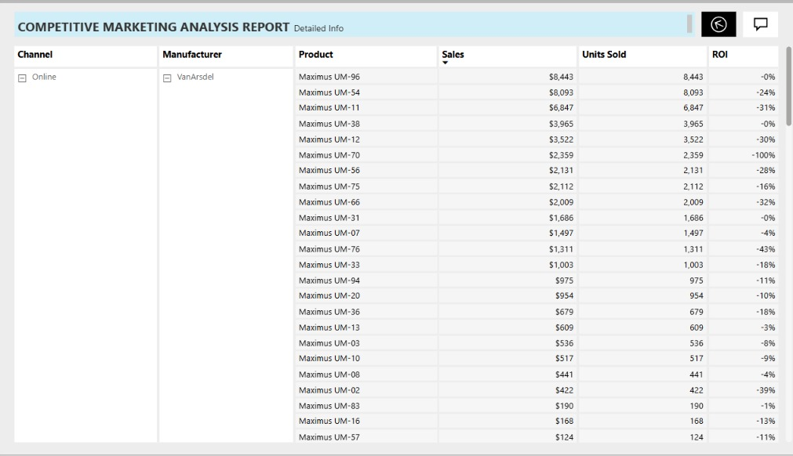

 digital payment adoption and optimize channel performance.
# Retail Competitive Market Analysis – Power BI

**Tool:** Power BI  
**Data:** 1,500+ Retail Transactions

## 📊 Project Overview
An interactive Power BI dashboard designed to analyze retail sales performance across different product categories, sales channels, and Indian states.
The dashboard provides actionable insights into revenue, sales trends, customer purchasing behavior, and regional performance.

## Business Objectives
- Analyze overall sales and revenue performance
- Identify top-performing product categories
- Compare sales across different channels
- Evaluate state-wise sales performance
- Understand customer payment preferences
- Identify opportunities for business growth

## Key Insights
- **Electronics** is the highest-revenue product category.
- **COD (Cash on Delivery)** is the dominant payment method, indicating an opportunity to strengthen digital payment adoption.
- **Maharashtra, Uttar Pradesh, and Delhi** are among the top-performing states.
- Sales performance varies significantly across different channels and regions.
- Regional and payment-method analysis can help businesses improve customer experience and sales strategy.

## Tools & Skills
- Power BI
- Data Cleaning & Transformation
- Power Query
- DAX
- Data Visualization
- Business Analysis
- KPI & Dashboard Development
- Sales & Market Analysis

## Dashboard Features
- Sales & Revenue KPIs
- Category-wise Performance
- Channel-wise Sales Analysis
- State-wise Sales Analysis
- Payment Method Analysis
- Interactive Filters & Slicers
- Business Performance Insights

## 💡 Business Value
The dashboard helps decision-makers identify high-performing markets, understand customer purchasing behavior, and make data-driven decisions related to sales, channels, and regional strategy.

## 📁 Project Files
- `Retail Competitive_Marketing_Analysis_Parul...` – Power BI Dashboard
- `Orders_Modified.csv` – Orders dataset
- `Details_Modified.csv` – Transaction details dataset
- Dashboard screenshots – Visual reference
- [Dashboard](I3.jpeg)

## 👩‍💻 Author
**Parul Bhatia**
MBA – Marketing & Business Analytics  
Business Analyst | Power BI | Excel | Data Analysis
